# RPGLang's AST Standard

## Node Types
**Non-Terminal:**
1. Operand (`OP_TYPE`) - stores `OpType`
2. Control Flow (`CTRL_TYPE`) - stores `CtrlType`
**Terminal:**
1. Identifier (`IDENT_TYPE`) - stores `StringView` (sized string)
2. Number (`NUM_TYPE`) - stores `double`
3. Variable Type (`VAR_TYPE_TYPE`) - stores `VarType`

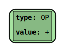
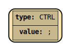

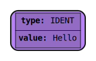
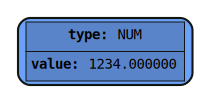
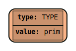

_Figures 1-5. Simplified orphan nodes of all types_

## AST Node Connection Rules

### Unary Operations

Unary Operations (`not`, unary `-`, etc.) have only one child located in their `right` field

`not 0I`

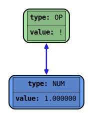

_Figure 6. Unary not_

### Binary Operations

Unary Operations (`+`, `-`, etc.) have two children, both `right` and `left`

`0I unite apple`

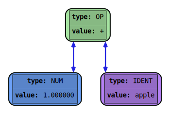

_Figure 7. Binary plus_

### Statement Chain

Statements are, in one way or another, all come down to having a `CTRL_SEMIC` (`;`) node. These nodes are used to chain consequitive statements together

`left` field of `;` node is the statement itself, while `right` field points at the next statement

```
0VIII empower 0III;
dog;
not apple;
```

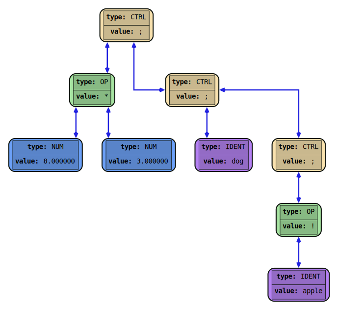

_Figure 8. A few statements forming a chain_

### Statement Block

Statement block is a way of wrapping several statements into one, creating a branching mechanism for the AST

Statement block happens when the `left` field of the `;` node doesn't directly store the statement, but instead a statement chain

```
{
0VIII empower 0III;
dog;
}
not apple;
```
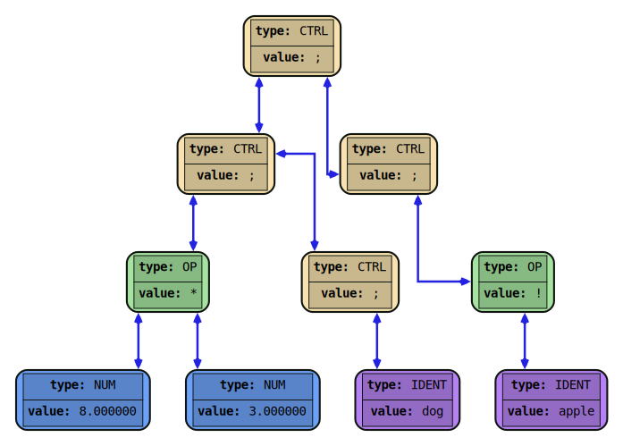;

_Figure 9. Two statements being in a chain, the first is a statement block and the second isn't_

### Conditional statements

`if` statements store the condition in the `left` field, and the body in the `right` field. The body itself is a statement (or, particularly a statement block), that can form a chain with next statements (which wont be a part of `if`'s body). If the body needs to execute more than one statement inside of itself, the body becomes a statement block storing the branch of the `if` condition being met.

`while` and `until` nodes follow the same principles

```
if (apple and dog)
    foo;
bar;
```

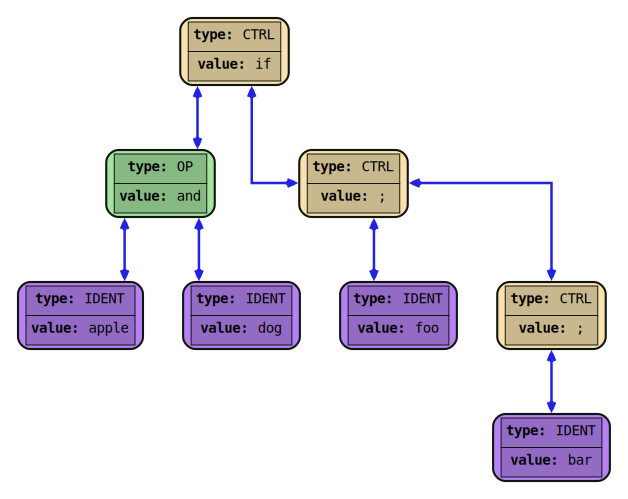;

_Figure 10. If statement_

### Else statements

After `if`'s body, an `else` node may follow, whose `right` field points at a statement which will be done if the condition of the `if` above wasn't met. Particularly `right` field could be an `if` itself, since `if` is also a statement

```
if (apple and dog)
    foo;
else 
    bar;
baz;
```

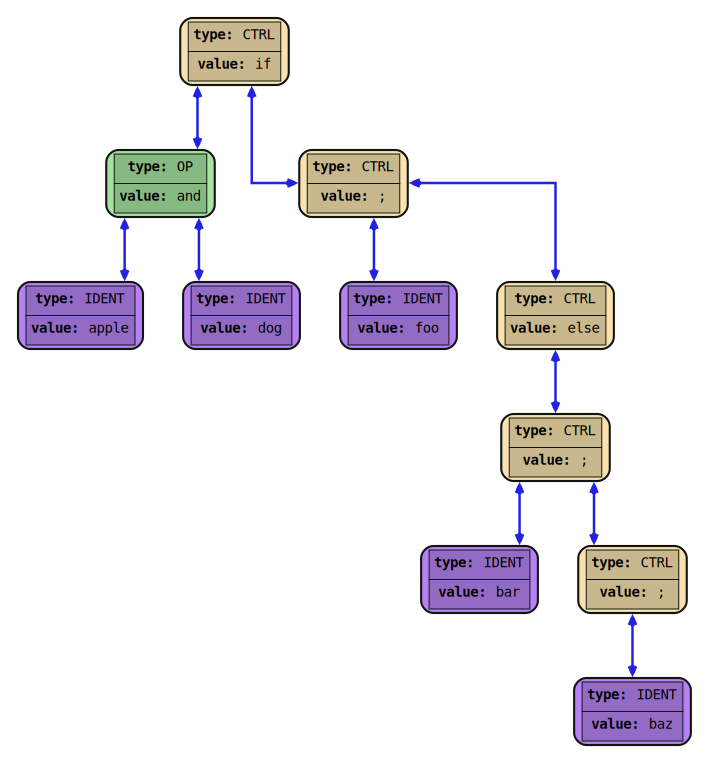;

_Figure 11. If statement with an else branch_

### Variable Assignment


