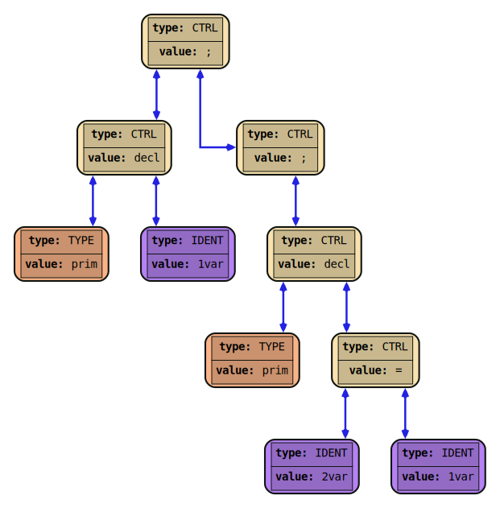
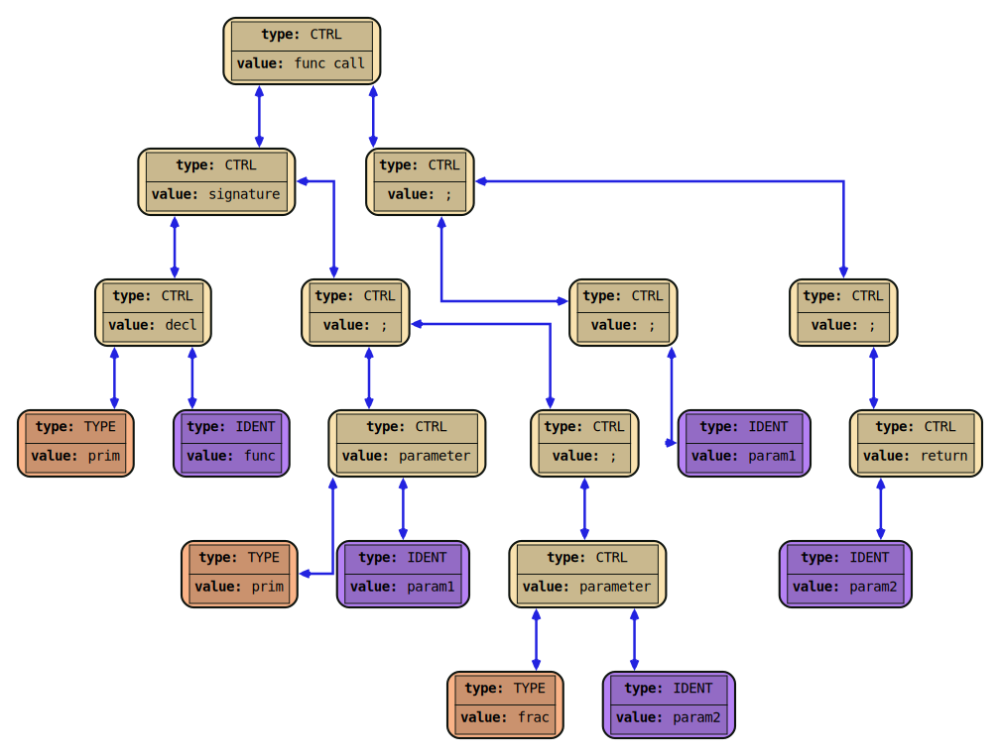
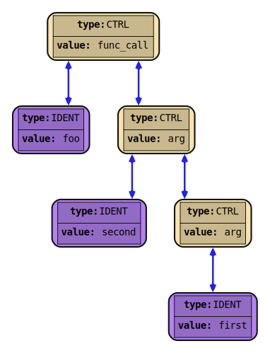

# RPGLang's AST Standard

## Node Types
**Non-Terminal:**
1. Operand (`OP_TYPE`) - stores `OpType`
2. Control Flow (`CTRL_TYPE`) - stores `CtrlType`

**Terminal:**
1. Identifier (`IDENT_TYPE`) - stores `StringView` (sized string)
2. Number (`NUM_TYPE`) - stores `double`
3. Variable Type (`VAR_TYPE_TYPE`) - stores `VarType`


_Figures 1-5. Simplified orphan nodes of all types_

## AST Node Connection Rules

### Unary Operations

Unary Operations (`not`, unary `-`, etc.) have only one child located in their `right` field

`not 0I`


_Figure 6. Unary not_

### Binary Operations

Unary Operations (`+`, `-`, etc.) have two children, both `right` and `left`

`0I unite apple`


_Figure 7. Binary plus_

### Statement Chain

Statements are, in one way or another, all come down to having a `CTRL_SEMIC` (`;`) node. These nodes are used to chain consequitive statements together

`left` field of `;` node is the statement itself, while `right` field points at the next statement

```
0VIII empower 0III;
dog;
not apple;
```


_Figure 8. A few statements forming a chain_

### Statement Block

Statement block is a way of wrapping several statements into one, creating a branching mechanism for the AST

Statement block happens when the `left` field of the `;` node doesn't directly store the statement, but instead a statement chain

```
{
0VIII empower 0III;
dog;
}
not apple;
```
;

_Figure 9. Two statements being in a chain, the first is a statement block and the second isn't_

### Conditional statements

`if` statements store the condition in the `left` field, and the body in the `right` field. The body itself is a statement (or, particularly a statement block), that can form a chain with next statements (which wont be a part of `if`'s body). If the body needs to execute more than one statement inside of itself, the body becomes a statement block storing the branch of the `if` condition being met.

`while` and `until` nodes follow the same principles

```
if (apple and dog)
    foo;
bar;
```

;

_Figure 10. If statement_

### Else statements

After `if`'s body, an `else` node may follow, whose `left` field points at a statement which will be done if the condition of the `if` above wasn't met. Particularly `left` field could be an `if` itself, since `if` is also a statement. `else`'s `right` field points to the rest of statement chain.

```
if (apple and dog)
    foo;
else 
    bar;
baz;
```

;

_Figure 11. If statement with an else branch_

### Variable Declaration

Consists of `decl` node, `left` field is a variable's type, and `right` is either an assignment statement, or an identifier

```
prim 1var;
prim 2var mirror 1var;
```

;

_Figure 11. Variable declarations (with and without an initialization)_

### Function Declaration

TODO: Declaration has reverse order of params related to a function call node

Consists of `func decl` node, `left` field is a `signature`, and `right` is functions body.

`signature`: `left` is a `decl`, right is a parameter list

`decl`: `left` is a return type, `right` is a function's name

parameter list: `param` nodes chained together with `;` nodes (in the same way the statements are chained). If the function accepts no parameters, this field is `NULL`

`param`: `left` is a parameter's type, `right` is a parameters name

Note: `complete` keyword denotes a return statement

```
prim func(prim param1; frac param2) {
    param1;
    complete param2;
}
```



_Figure 12. Function declaration_

### Function Call

Consists of `func call` node, `left` field is a function's name (identifier),
and `right` is an argument list, which are expressions chained together with `arg` nodes (same way the statements are chained). If the function call has no arguments, `right` is `NULL`

Note: the arguments are chained in a reverse order, e.g. the last argument is always first in the chain.

```
foo(first; second);
```



_Figure 13. Function call_

### Other

1. return statement stores the return expression in `left` field
2. assignment, while being a control node, follows the logic of binary operations
3. function declarations are chained with `;` nodes in the same way statements are. So, from a topdown view, the tree is just a chain of function declarations chained with `;`

TODO: update images to have clear distinction of whether the fields are left, or right, or parent
TODO: RAW_IDENT and SYMBOL changes in AST_STANDARD.md
