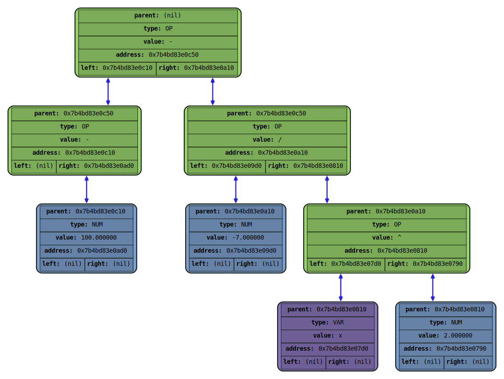

# RPGLang

(очень временное вступление, требует доработок)

RPGLang - эзотерический язык программирования в парадигме Командно-Ориентированного Программирования™ (Team Oriented Programming™ - TOP). В RPGLang'е обязанности программы делигируются не одному программисту, а группе RPG-классов, каждый из которых имеет свои сильные и слабые стороны. Чтобы программировать на данном языке, нужно уметь эффективно комбинировать действия классов, ведь если требовать от мага умений махать мечом, то далеко вы не уедете.

План по разработке:

1. Лексер языка (frontend lexer)
2. Синтаксический анализ языка (frontend)
3. Оптимизация (middleend)
4. Бэкэнд транспиляция в Си (c-backend)
5. Бэкэнд в ассемблер (backend)
6. Улучшение парсера до packrat (frontend)
7. Реверс-фронтенд (reverse-frontend)

Язык находится в разработке, и на данный момент не готов к использованию.

Держите утешительную картинку дампа дерева:

